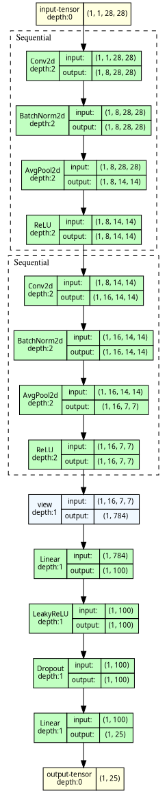
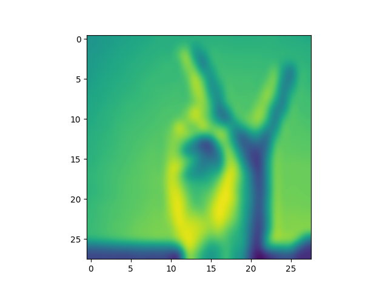

# 🔥 PyTorch Lightning ⚡️: Sign MNIST Dataset Example  🤗 

> я в отпуске не дома, пришлось похитить ноут Димы :)

[](https://www.python.org)

[](https://pytorch.org)

## Motivation
Вы когда-нибудь считали, сколько строк кода надо сваять, чтобы обучить нейронку?)

А я вот посчитала, когда поступила на курс [🤖 Машинное обучение с помощью ClearML и Pytorch Lightning ⚡](https://stepik.org/course/214389?auth=login)

80 строк кода занимает только трейн-луп :) а еще собрать надо загрузчика и тд, и тп. 

Как сейчас помню свой курсач по "Введению в глубокое обучение" в [НИУ ВШЭ](https://www.hse.ru/ma/mds/news/909801290.html) - у меня было два тренировочных цикла - мы тюнили и конволюшку, и берта. Это был JN по размеру сопоставимый с "Войной и миром" Льва Толстого. Запутаться, допустить ошибку там можно было очень легко, мы выживали как могли. Считаю, что нельзя останавливаться на достигнутом любительском уровне, нужно переходить на качественный код 🫡

Из явных преимуществ для меня:
- запуск с консоли
- хуки
- модульность
- структурированность, уменьшение вероятности технических ошибок
- легко экспериментировать, изменяя конфиг
- продакшн стайл, дорого-богато (заходите в код, посмотрите)

Пришлось немного попотеть, но было интересно - в результате родился такой проект :)

## Files' tree
📁 pytorch_lightning_practice/<br>
├─📁 dataset/ (не загружалась на гит, но загрузится во время выполнения кода)<br> 
│ ├─📄 sign_mnist_test.csv<br>
│ └─📄 sign_mnist_train.csv<br>
├─📁 lightning_logs/<br>
│ └─📁 MyConvNet/<br>
│   └─📁 version_0/<br>
│     ├─📄 hparams.yaml<br>
│     └─📄 metrics.csv<br>
├─📁 pics/<br>
│ ├─📄 alphabet.png<br>
│ ├─📄 pavloops_myconvnet_graph.png<br>
│ ├─📄 test_picture.png<br>
│ └─📄 training_plot.png<br>
├─📁 saved_models/<br>
│ ├─📄 epoch=15-step=2752.ckpt<br>
│ ├─📄 epoch=17-step=3096.ckpt<br>
│ └─📄 epoch=19-step=3440.ckpt<br>
├─📁 src/<br>
│ ├─📁 tests/<br>
│ │ └─📄 custom_metrics_test.py<br>
│ ├─📄 convolutional_network.py<br>
│ ├─📄 custom_metric.py<br>
│ ├─📄 network_trainer.py<br>
│ └─📄 sign_data_module.py<br>
├─📁 terminal_logs/<br>
│ ├─📄 first_run_terminal_log.txt<br>
│ └─📄 second_run_terminal_log.txt<br>
├─📄 .gitignore<br>
├─📄 README.md<br>
├─📄 config.py<br>
├─📄 pavloops_solution2.py<br>
├─📄 requirements.txt<br>
└─📄 test_picture.png<br>

## Dataset
Датасет - американский язык жестов, почитать о нём можно тут: [Sign MNIST Dataset](https://www.kaggle.com/datasets/datamunge/sign-language-mnist)


## Model
А вот и претендент на то, чтобы классно обучаться с обвязкой Pytorch Lightning :) простая сеточка - колбаса-конволюшечка:



## How to Run (Linux OS)

> На винде у меня игрушечки, я не делала под неё адаптацию :)

1. Склонируй репо
```bash
git clone https://github.com/PavloOps/pytorch_lightning_practice.git
```

2. Сделай виртуальное окружение, поставь либы из файлика requirements.txt:
```bash
python3 -m venv venv && source venv/bin/activate && pip install -r requirements.txt && pip install lightning[extra]
```

3. Покрути гиперы в конфигах по желанию (см. файлик config.py)

4. Запускаем обучение

```bash
python pavloops_solution2.py --fast_dev_run
```

> Опа, а это что за флаг такой "fast_dev_run"? Его можно не звать, но... Это то, что является хорошей практикой, запустить сеточку для проверки, всё ли живое и готовое к обучению, в копилку, спасибо :)

## How does it work?


```python
    # Решение начинается с того, что с CLI будет собран флаг fast_dev_run (по умолчанию он True)

    cfg = CFG()   # импортируем конфигурацию из файлика config.py

    visualize_network(MyConvNet(cfg), "pavloops_myconvnet_graph")   # создаем и сохраняем граф нейросети

    run_experiment(cfg, need_dev_run=fast_dev_run)   # запускаем наш эксперимент
    
    make_one_picture_inference(config=cfg, dir_path="saved_models", wanted_index=12)   # делаем инференс по желаемому индексу из тестового датасета
    
    simple_visualize_metrics("lightning_logs/MyConvNet/version_0/metrics.csv")   # смотрим графики обучения (пока тут, потом будет в ClearML)
```

Хотелось бы отдельно немного рассказать о функции run_experiment:
- прежде всего, используется собственная функция PyTorch Lightning "зазерни всё" для воспроизводимости экспериментта
- потом используется специально созданный загрузчик, который наследуется от LightningDataModule. Вот тут мы используем все богатства хуков:
  - prepare_data() позволяет нам загрузить датасет по ссылкам и сохранить на жетский диск (это уже философия лайтнинга). Более того, сделала функции _calculate_sha256 и _file_is_available, чтобы проверить, а был ли уже загружен файл, чтобы не загружать его снова и был ли он загружен полноценно. Всё загрузится, распакуется, подготовится :)
  - setup() как раз займется тем, что заберет файлы с жесткого диска и отправит в RAM: предварительно подготовит их - для трейна сделает аугментацию, например, а также подготовит валидационную часть (обратите внимание на то, что указывается параметр stratify в функции train_test_split, чтобы мы сохранили распределение классов на валидации)
  - также учитывается философия стейджинга
  - в teardown будет работать сборщик мусора
  - кстати да, класс, который датасет делает надо реализовать, иначе загрузчику нечем будет датасет клепать
- сеточка сделана уже не на чистом торче, а с помощью LightningModule. Тут тоже используются хуки training_step() и тд :)
- логгироваться будут три метрики: две уже реализованные в torchmetrics (FBetaScore, AUROC) и самописный False Discovery Rate (FDR). Под него написаны тесты для самопроверки, чтобы всё считалось как задумано
- в трейнер добавлены два коллбэка (ранний останов и сохранение весов модельки), CSV-логгер (чтобы потом нарисовать графики обучения - это костылёк, потом графики будут в ClearML)
- для инференса дополнительно сделала простенькая функция, которая будет забирать последнюю лучшую модельку


## Results  🎯🏆

1. Как выглядит первый запуск с загрузкой файлов с гита и обучением (это была первая часть лабы): [first_run_terminal_log.txt](terminal_logs%2Ffirst_run_terminal_log.txt)
2. Как выглядит запуск обучения, когда файлы уже загружены, добавлены метрики, коллбэки (это была вторая часть лабы): [second_run_terminal_log.txt](terminal_logs%2Fsecond_run_terminal_log.txt)
3. А вот и картиночка с инференса:



## Final Notes

В проекте дофига каких-то файлов, ООП, конфиги-папки, алло, где упрощение, где однострочник, что за развод? По опыту: в промышленной разработке - это очень компактно, особенно, если это качественно обвязано и хорошо масштабируемо, правда-правда.

Мне понравилось, харды прокачались)

🌟🌟🌟Если вам понравилось моё решение, и оно было вам полезно - сделайте тык в звездочку, вам не сложно, а мне будет приятно ❤️❤️❤️
