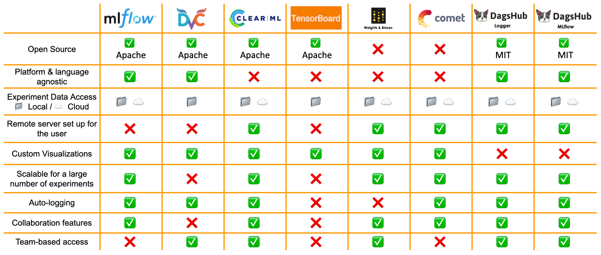
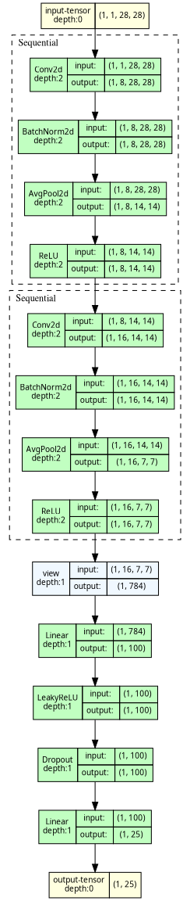
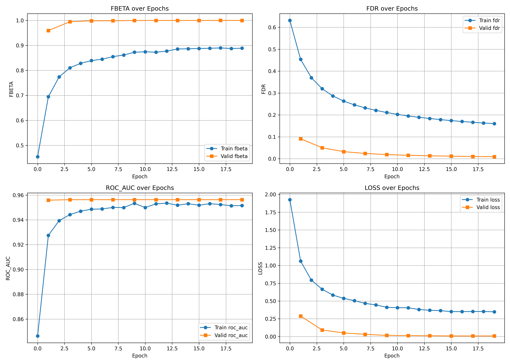
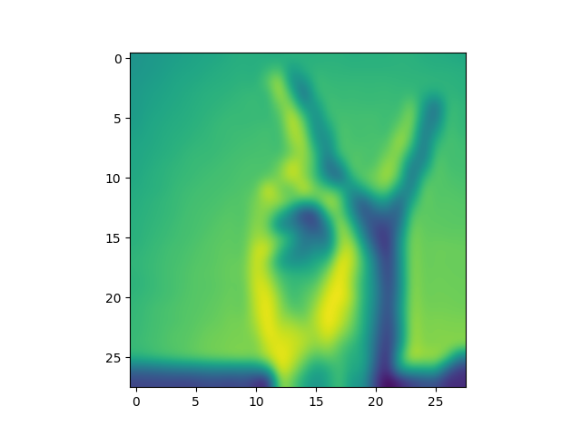
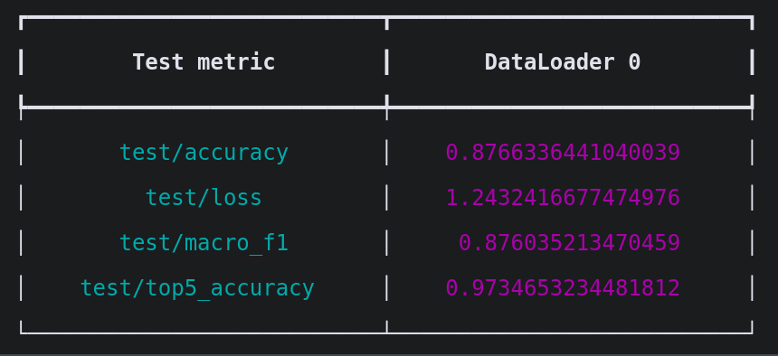
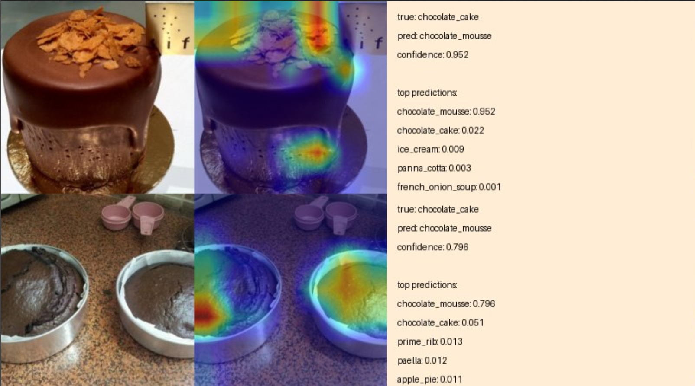
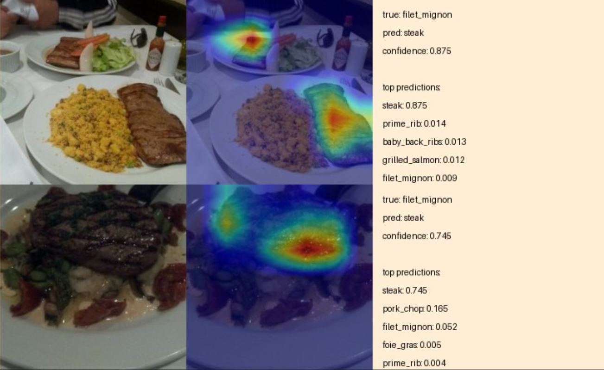

# [🤖 ClearML & PyTorch Lightning Course's Solutions (Stepik)](https://stepik.org/course/214389?auth=login)

## [Lab 1: Logging](https://github.com/PavloOps/pytorch_lightning_practice/tree/main/lab_1_logging)



## [Lab 2-3: Trainer & Sign MNIST Dataset Example  🤗](https://github.com/PavloOps/pytorch_lightning_practice/tree/main/lab_2_3) 

## (👑🥇 merch winner 🥳🎉)
[](https://www.python.org)

[](https://pytorch.org)
## Motivation
Вы когда-нибудь считали, сколько строк кода надо сваять, чтобы обучить нейронку?)

А я вот посчитала, когда поступила на курс: 80 строк кода занимает только трейн-луп :) а еще собрать надо загрузчика и тд, и тп. 

Как сейчас помню свой курсач по "Введению в глубокое обучение" в [НИУ ВШЭ](https://www.hse.ru/ma/mds/news/909801290.html) - у меня было два тренировочных цикла - мы тюнили и конволюшку, и берта. Это был JN по размеру сопоставимый с "Войной и миром" Льва Толстого. Запутаться, допустить ошибку там можно было очень легко, мы выживали как могли. Считаю, что нельзя останавливаться на достигнутом любительском уровне, нужно переходить на качественный код 🫡

Из явных преимуществ для меня:
- запуск с консоли
- хуки
- модульность
- структурированность, уменьшение вероятности технических ошибок
- легко экспериментировать, изменяя конфиг
- продакшн стайл, дорого-богато (заходите в код, посмотрите)

Пришлось немного попотеть, но было интересно - в результате родился такой проект :)

## Files' tree
📁 pytorch_lightning_practice/<br>
├─📁 dataset/ (не загружалась на гит, но загрузится во время выполнения кода)<br> 
│ ├─📄 sign_mnist_test.csv<br>
│ └─📄 sign_mnist_train.csv<br>
├─📁 lightning_logs/<br>
│ └─📁 MyConvNet/<br>
│   └─📁 version_0/<br>
│     ├─📄 hparams.yaml<br>
│     └─📄 metrics.csv<br>
├─📁 pics/<br>
│ ├─📄 alphabet.png<br>
│ ├─📄 pavloops_myconvnet_graph.png<br>
│ ├─📄 test_picture.png<br>
│ └─📄 training_plot.png<br>
├─📁 saved_models/<br>
│ ├─📄 epoch=15-step=2752.ckpt<br>
│ ├─📄 epoch=17-step=3096.ckpt<br>
│ └─📄 epoch=19-step=3440.ckpt<br>
├─📁 src/<br>
│ ├─📁 tests/<br>
│ │ └─📄 custom_metrics_test.py<br>
│ ├─📄 convolutional_network.py<br>
│ ├─📄 custom_metric.py<br>
│ ├─📄 network_trainer.py<br>
│ └─📄 sign_data_module.py<br>
├─📁 terminal_logs/<br>
│ ├─📄 first_run_terminal_log.txt<br>
│ └─📄 second_run_terminal_log.txt<br>
├─📄 .gitignore<br>
├─📄 README.md<br>
├─📄 config.py<br>
├─📄 pavloops_solution2.py<br>
├─📄 requirements.txt<br>
└─📄 test_picture.png<br>

## Dataset
Датасет - американский язык жестов, почитать о нём можно тут: [Sign MNIST Dataset](https://www.kaggle.com/datasets/datamunge/sign-language-mnist)


## Model
А вот и претендент на то, чтобы классно обучаться с обвязкой Pytorch Lightning :) простая сеточка - колбаса-конволюшечка:



## How to Run (Linux OS)

> На винде у меня игрушечки, я не делала под неё адаптацию :)

1. Склонируй репо
```bash
git clone https://github.com/PavloOps/pytorch_lightning_practice.git
```

2. Сделай виртуальное окружение, поставь либы из файлика requirements.txt:
```bash
python3 -m venv venv && source venv/bin/activate && pip install -r requirements.txt && pip install lightning[extra]
```

3. Покрути гиперы в конфигах по желанию (см. файлик config.py)

4. Запускаем обучение

```bash
python pavloops_solution2.py --fast_dev_run
```

> Опа, а это что за флаг такой "fast_dev_run"? Его можно не звать, но... Это то, что является хорошей практикой, запустить сеточку для проверки, всё ли живое и готовое к обучению, в копилку, спасибо :)

## How does it work?

```python
    # Решение начинается с того, что с CLI будет собран флаг fast_dev_run (по умолчанию он True)

cfg = CFG()  # импортируем конфигурацию из файлика config.py

visualize_network(MyConvNet(cfg), "pavloops_myconvnet_graph")  # создаем и сохраняем граф нейросети

run_experiment(cfg, need_dev_run=fast_dev_run)  # запускаем наш эксперимент

make_one_picture_inference(config=cfg, dir_path="lab_2_3_trainer/saved_models",
                           wanted_index=12)  # делаем инференс по желаемому индексу из тестового датасета

simple_visualize_metrics(
  "lightning_logs/MyConvNet/version_0/metrics.csv")  # смотрим графики обучения (пока тут, потом будет в ClearML)
```

Хотелось бы отдельно немного рассказать о функции run_experiment:
- прежде всего, используется собственная функция PyTorch Lightning "зазерни всё" для воспроизводимости экспериментта
- потом используется специально созданный загрузчик, который наследуется от LightningDataModule. Вот тут мы используем все богатства хуков:
  - prepare_data() позволяет нам загрузить датасет по ссылкам и сохранить на жетский диск (это уже философия лайтнинга). Более того, сделала функции _calculate_sha256 и _file_is_available, чтобы проверить, а был ли уже загружен файл, чтобы не загружать его снова и был ли он загружен полноценно. Всё загрузится, распакуется, подготовится :)
  - setup() как раз займется тем, что заберет файлы с жесткого диска и отправит в RAM: предварительно подготовит их - для трейна сделает аугментацию, например, а также подготовит валидационную часть (обратите внимание на то, что указывается параметр stratify в функции train_test_split, чтобы мы сохранили распределение классов на валидации)
  - также учитывается философия стейджинга
  - в teardown будет работать сборщик мусора
  - кстати да, класс, который датасет делает надо реализовать, иначе загрузчику нечем будет датасет клепать
- сеточка сделана уже не на чистом торче, а с помощью LightningModule. Тут тоже используются хуки training_step() и тд :)
- логгироваться будут три метрики: две уже реализованные в torchmetrics (FBetaScore, AUROC) и самописный False Discovery Rate (FDR). Под него написаны тесты для самопроверки, чтобы всё считалось как задумано
- в трейнер добавлены два коллбэка (ранний останов и сохранение весов модельки), CSV-логгер (чтобы потом нарисовать графики обучения - это костылёк, потом графики будут в ClearML)
- для инференса дополнительно сделала простенькая функция, которая будет забирать последнюю лучшую модельку


## Results  🎯🏆

1. Как выглядит первый запуск с загрузкой файлов с гита и обучением (это была первая часть лабы): [first_run_terminal_log.txt](terminal_logs%2Ffirst_run_terminal_log.txt)
2. Как выглядит запуск обучения, когда файлы уже загружены, добавлены метрики, коллбэки (это была вторая часть лабы): [second_run_terminal_log.txt](terminal_logs%2Fsecond_run_terminal_log.txt)
3. Графики с процесса обучения




4. А вот и картиночка с инференса:



## Final Notes

В проекте дофига каких-то файлов, ООП, конфиги-папки, алло, где упрощение, где однострочник, что за развод? По опыту: в промышленной разработке - это очень компактно, особенно, если это качественно обвязано и хорошо масштабируемо, правда-правда.

Мне понравилось, харды прокачались)

🌟🌟🌟Если вам понравилось моё решение, и оно было вам полезно - сделайте тык в звездочку, вам не сложно, а мне будет приятно ❤️❤️❤️

## [Lab 4: GAN & PyTorch Lighting  🤗](lab_4_gan/pavloops_solution4.py) 

Клонируй с гита:

```bash
git clone https://github.com/PavloOps/pytorch_lightning_practice.git && cd lab_4_gan
```

Запуск с терминала (в этот раз делала под Windows для разнообразия):

```bash
py pavloops_solution4.py -F -E 12 -D 2
```

Аналогичная команда с полными именами параметров:

```bash
py pavloops_solution4.py --fast_dev_run --epoch 12 --debug_samples_epoch 2
```

Результат в юайке ClearML:

https://app.clear.ml/projects/a7f426d19f9f493980c13330e8aa07b6/experiments/afc67674c8b34197b32644a0ff02324a/output/execution

Мои логи:

```
$ py pavloops_solution4.py -F -E 12 -D 2
Enter CLEARML_WEB_HOST:
Enter CLEARML_API_HOST:
Enter CLEARML_FILES_HOST:
Enter CLEARML_API_ACCESS_KEY:
Enter CLEARML_API_SECRET_KEY:
All environment variables are set.
ClearML Task: created new task id=afc67674c8b34197b32644a0ff02324a
ClearML results page: https://app.clear.ml/projects/a7f426d19f9f493980c13330e8aa07b6/experiments/afc67674c8b34197b32644a0ff02324a/output/log
torch version:  2.2.2+cu121
cuda version:  12.1
gpu is available:  True
device name:  NVIDIA GeForce RTX 3080 Ti Laptop GPU
Seed set to 2025
GPU available: True (cuda), used: True
TPU available: False, using: 0 TPU cores
HPU available: False, using: 0 HPUs
Running in `fast_dev_run` mode: will run the requested loop using 1 batch(es). Logging and checkpointing is suppressed.
[2025-Nov-03 14:41:53] INFO: Processed dataset not found — downloading raw MNIST...
[2025-Nov-03 14:42:23] INFO: Processed MNIST saved to ../data\dataset.pt
[2025-Nov-03 14:42:29] INFO: Train and validation datasets are loaded in RAM.
LOCAL_RANK: 0 - CUDA_VISIBLE_DEVICES: [0]

  | Name             | Type          | Params | Mode
-----------------------------------------------------------
0 | generator        | Generator     | 1.8 M  | train
1 | discriminator    | Discriminator | 138 K  | train
2 | criterion        | BCELoss       | 0      | train
3 | resize_transform | Resize        | 0      | train
-----------------------------------------------------------
1.9 M     Trainable params
0         Non-trainable params
1.9 M     Total params
7.729     Total estimated model params size (MB)
23        Modules in train mode
0         Modules in eval mode
`Trainer.fit` stopped: `max_steps=1` reached.
Debug run has been finished.
GPU available: True (cuda), used: True
TPU available: False, using: 0 TPU cores
HPU available: False, using: 0 HPUs
[2025-Nov-03 14:43:08] INFO: Processed dataset already exists — skipping download.
2025-11-03 14:43:14,263 - clearml.model - WARNING - Connecting multiple input models with the same name: `dataset`. This might result in the wrong model being used when executing remotely
[2025-Nov-03 14:43:19] INFO: Train and validation datasets are loaded in RAM.
C:\Users\olgal\PycharmProjects\pytorch_lightning_practice\.venv\Lib\site-packages\lightning\pytorch\callbacks\model_checkpoint.py:654: UserWarning:

Checkpoint directory C:\Users\olgal\PycharmProjects\pytorch_lightning_practice\lab_4_gan exists and is not empty.

LOCAL_RANK: 0 - CUDA_VISIBLE_DEVICES: [0]

  | Name             | Type          | Params | Mode
-----------------------------------------------------------
0 | generator        | Generator     | 1.8 M  | train
1 | discriminator    | Discriminator | 138 K  | train
2 | criterion        | BCELoss       | 0      | train
3 | resize_transform | Resize        | 0      | train
-----------------------------------------------------------
1.9 M     Trainable params
0         Non-trainable params
1.9 M     Total params
7.729     Total estimated model params size (MB)
23        Modules in train mode
0         Modules in eval mode
Epoch 1: 100%|███████████████████████████████████████████████████████████████████████████████████| 750/750 [00:08<00:00, 89.48it/s, v_num=0, train/loss_discriminator=0.457, train/loss_generator=1.120]Metric val/loss_generator improved. New best score: 14.148████████████████████████████████████████████████████████████████████████████████████████████████████████████| 187/187 [00:00<00:00, 222.88it/s] 
Epoch 11: 100%|█████████████████████████| 750/750 [00:13<00:00, 57.55it/s, v_num=0, train/loss_discriminator=0.169, train/loss_generator=2.520, val/loss_discriminator=0.0986, val/loss_generator=21.80]Monitored metric val/loss_generator did not improve in the last 5 records. Best score: 14.148. Signaling Trainer to stop.██████████████████████████████████████████████| 187/187 [00:01<00:00, 94.11it/s]
Epoch 11: 100%|█████████████████████████| 750/750 [00:15<00:00, 49.78it/s, v_num=0, train/loss_discriminator=0.169, train/loss_generator=2.520, val/loss_discriminator=0.0951, val/loss_generator=22.50]`Trainer.fit` stopped: `max_epochs=12` reached.
Epoch 11: 100%|█████████████████████████| 750/750 [00:15<00:00, 49.78it/s, v_num=0, train/loss_discriminator=0.169, train/loss_generator=2.520, val/loss_discriminator=0.0951, val/loss_generator=22.50] 

olgal@DESKTOP-CH6JPSI MINGW64 ~/PycharmProjects/pytorch_lightning_practice/lab_4_gan (main)
```

Прогресс генератора можно посмотреть в ClearML: debug samples -> Generated Samples, --all, но можно и тут :)

<br>
<br>
<br>
<br>
<br>
<br>


# [FINAL PROJECT](final_project/Makefile)

## [ClearML Result UI page](https://app.clear.ml/projects/a7f426d19f9f493980c13330e8aa07b6/experiments/6f3b8f5d93854931b11f378d23be7e37/output/execution)

## Project Summary

Цель проекта - обучить классификатор изображений еды на датасете Food-101 и собрать воспроизводимый ML-pipeline вокруг эксперимента: подготовка данных, обучение, логирование, анализ ошибок, экспорт модели и инференс.

Основные технические решения:

* **Model:** ConvNeXt-Tiny с ImageNet-pretrained весами и замененной classifier head на 101 класс Food-101.
* **Training framework:** PyTorch Lightning для структуры train/validation/test loop, callbacks, checkpointing и метрик.
* **Experiment tracking:** ClearML для логирования метрик, гиперпараметров, debug samples, Grad-CAM hard cases и лучших весов модели.
* **Data:** Food-101 загружается автоматически, проверяется по hash и делится на train/validation из официального train split; официальный test split используется только для финальной оценки.
* **Result:** test accuracy = **0.8766**, test macro F1 = **0.8760**, test top-5 accuracy = **0.9735**.

Фишки проекта: автоматический error analysis, сохранение hard validation cases, Grad-CAM визуализации для сложных классов, экспорт лучшей модели в ONNX и отдельный prediction pipeline для пользовательских изображений.

Future work: дообучить backbone дольше, подобрать augmentations для похожих классов и отдельно поработать с группами ошибок вроде chocolate cake/chocolate mousse и steak/filet mignon.


Наконец-то высвободилось немного времени, и я смогла допилить финалку :) Прежде всего, хочу отметить то,
насколько изменился подход к обучению сетки. Помните, я вначале упоминала ноутбук, который сдавала в Вышке 
в качестве курсача по предмету "Введение в глубокое обучение"? Да-да, я нашла его, представляете :) [Вот он, мой старичок "ДО"](final_project/notebooks/DL_final_project_Pavlova.ipynb).
В то время я была очень собой довольна, что одолела его (кстати, это только половина ноутбука, вторая половина была по НЛП, но я её по этическим некоторым соображениям вырезала).
Так вот, конечно, разница очевидна. И мне нравится то, что тогда я смогла разобраться, как под капотом работает вся обучающая часть, а сейчас - не фиксироваться уже на этих нюансах, а отдать на откуп ClearML & PytorchLightning, больше
сфокусироваться самом процессе тюнинга. К слову, вышло ОЧЕНЬ удобно и интересно. ГОРАЗДО лучше, чем было. 
Гештальт с [датасетом Food101](final_project/references/bossard_eccv14_food-101.pdf) закрыт :)

P.S. В 2024 году VIT-модель набрала на тесте 90% точности, а RESNET-50 70% точности.
Для конволюшки посовременее результат очень даже порадовал:



> В качестве backbone использовалась архитектура ConvNeXt-Tiny, предложенная
  Liu et al. в работе [“A ConvNet for the 2020s” (CVPR 2022)](https://openaccess.thecvf.com/content/CVPR2022/html/Liu_A_ConvNet_for_the_2020s_CVPR_2022_paper.html). Авторы показывают,
  что модернизированная сверточная архитектура может конкурировать с vision
  transformers, сохраняя простоту и эффективность классических ConvNet-подходов.


P.S.S. Не вышло развести шоколадные пироги и шоколадные муссы :) а также стейки и филе-миньон, но это уже future work. Тепловая карта показывает, какие части изображения триггерили модель на выбор класса, прикольно, да?





## How to Start

Обучаем ConvNeXt-Tiny на Food-101 с помощью PyTorch Lightning и логируем эксперимент в ClearML.

### Requirements

* Python 3.13
* CUDA-compatible GPU is recommended for full training
* ClearML account and API credentials
* At least 10 GB of free disk space for Food-101, checkpoints and exported artifacts
* Docker with NVIDIA Container Toolkit for containerized GPU training

### Environment Setup

```bash
python -m venv .venv
source .venv/bin/activate
pip install -r requirements.txt
cp final_project/.env.example final_project/.env
```

Fill ClearML credentials in `final_project/.env`:

```text
CLEARML_API_ACCESS_KEY=...
CLEARML_API_SECRET_KEY=...
```

### Docker: запуск на машине с NVIDIA GPU

Полное обучение в Docker требует NVIDIA GPU, рабочего NVIDIA-драйвера на хосте и настроенного NVIDIA Container Toolkit для Docker.

1. Проверить, что хост видит видеокарту:

```bash
nvidia-smi
```

Команда должна вывести информацию о GPU. Если она падает, сначала нужно исправить NVIDIA-драйвер на хосте.

2. Проверить, что Docker умеет пробрасывать GPU в контейнер:

```bash
docker run --rm --gpus all nvidia/cuda:12.6.3-base-ubuntu24.04 nvidia-smi
```

Если команда выводит информацию о GPU, Docker готов к GPU-обучению.

Если команда падает с ошибкой вроде:

```text
failed to discover GPU vendor from CDI: no known GPU vendor found
```

нужно установить и настроить NVIDIA Container Toolkit:

```bash
sudo apt-get update
sudo apt-get install -y --no-install-recommends ca-certificates curl gnupg2

curl -fsSL https://nvidia.github.io/libnvidia-container/gpgkey \
  | sudo gpg --dearmor -o /usr/share/keyrings/nvidia-container-toolkit-keyring.gpg

curl -s -L https://nvidia.github.io/libnvidia-container/stable/deb/nvidia-container-toolkit.list \
  | sed 's#deb https://#deb [signed-by=/usr/share/keyrings/nvidia-container-toolkit-keyring.gpg] https://#g' \
  | sudo tee /etc/apt/sources.list.d/nvidia-container-toolkit.list

sudo apt-get update
sudo apt-get install -y nvidia-container-toolkit

sudo nvidia-ctk runtime configure --runtime=docker
sudo systemctl restart docker
```

После этого нужно снова проверить GPU внутри Docker:

```bash
docker run --rm --gpus all nvidia/cuda:12.6.3-base-ubuntu24.04 nvidia-smi
```

Если Docker всё ещё сообщает CDI-ошибку, можно вручную сгенерировать CDI specification:

```bash
sudo mkdir -p /etc/cdi
sudo nvidia-ctk cdi generate --output=/etc/cdi/nvidia.yaml
nvidia-ctk cdi list
sudo systemctl restart docker
```

И ещё раз проверить:

```bash
docker run --rm --gpus all nvidia/cuda:12.6.3-base-ubuntu24.04 nvidia-smi
```

3. Собрать Docker-образ из корня репозитория:

```bash
docker build -t food101-convnext .
```

4. Запустить smoke-check без ClearML. Первый запуск скачивает pretrained ConvNeXt weights; `-it` оставляет видимым progress bar скачивания, а примонтированный torch cache сохраняет веса между запусками контейнера:

```bash
docker run --rm -it --shm-size=2g \
  -v "$(pwd)/final_project/data:/app/final_project/data" \
  -v "$(pwd)/final_project/models:/app/final_project/models" \
  -v "$(pwd)/.cache/torch:/root/.cache/torch" \
  food101-convnext make train-smoke
```

5. Перед полным обучением создать `final_project/.env` из `.env.example` и заполнить ClearML credentials:

```bash
cp final_project/.env.example final_project/.env
```

```text
CLEARML_API_ACCESS_KEY=...
CLEARML_API_SECRET_KEY=...
```

6. Запустить полное GPU-обучение:

```bash
docker run --rm -it --gpus all --shm-size=8g \
  --env-file final_project/.env \
  -v "$(pwd)/final_project/data:/app/final_project/data" \
  -v "$(pwd)/final_project/models:/app/final_project/models" \
  -v "$(pwd)/final_project/reports:/app/final_project/reports" \
  -v "$(pwd)/.cache/torch:/root/.cache/torch" \
  food101-convnext make train
```

### Training Run

```bash
source .venv/bin/activate
cd final_project
make train
```
make train запускает полный pipeline: загрузку данных, обучение, валидацию,
тестирование, анализ ошибок, сохранение hard cases, экспорт модели в ONNX и
отправку результатов в ClearML.

Полная команда под капотом:

```bash
python src/modeling/train.py \
  --data_dir ./data/raw \
  --lr 0.0003 \
  --weights_path ./models/convnext_food101.ckpt \
  --onnx_path ./models/convnext_food101.onnx \
  --hard_cases_dir ./data/samples/hard_cases
```

Доступные команды Makefile:

| Command | Description |
|---|---|
| `make install` | Install project dependencies. |
| `make train-smoke` | Run a quick one-batch training check. |
| `make train` | Run the full training pipeline. |
| `make visualize-network` | Save the model architecture graph. |
| `make predict` | Run prediction on sample images. |
| `make lint` | Run `flake8` checks. |


Основные артефакты после запуска:

* models/convnext_food101.ckpt
* models/convnext_food101.onnx
* reports/figures/food101_confusion_matrix.png
* data/samples/hard_cases/
* data/samples/hard_cases_manifest.csv

Что логируется в ClearML:

* training, validation and test metrics;
* hyperparameters and full config;
* validation debug samples with Grad-CAM;
* hard confusion groups with Grad-CAM;
* best model checkpoint.


## Files' tree
• ./<br>
  ├── 📁 final_project/<br>
  │   ├── 📁 data/<br>
  │   │   └── 📁 samples/<br>
  │   │       ├── 📁 hard_cases/<br>
  │   │       ├── 📄 00_17_cheesecake.png<br>
  │   │       ├── 📄 01_86_sashimi.png<br>
  │   │       ├── 📄 02_97_takoyaki.png<br>
  │   │       ├── 📄 03_28_croque_madame.png<br>
  │   │       ├── 📄 04_98_tiramisu.png<br>
  │   │       ├── 📄 05_50_grilled_salmon.png<br>
  │   │       ├── 📄 06_36_falafel.png<br>
  │   │       ├── 📄 07_83_red_velvet_cake.png<br>
  │   │       └── 📄 hard_cases_manifest.csv<br>
  │   ├── 📁 debug_samples/<br>
  │   ├── 📁 models/<br>
  │   │   ├── 📁 convnext_food101/<br>
  │   │   │   └── 📁 archive/<br>
  │   │   ├── 📄 convnext_food101.ckpt<br>
  │   │   ├── 📄 convnext_food101.onnx<br>
  │   │   ├── 📄 food101-02-0.0000.ckpt<br>
  │   │   ├── 📄 food101-03-0.0000.ckpt<br>
  │   │   ├── 📄 food101-04-0.0000.ckpt<br>
  │   │   ├── 📄 food101-06-0.8271.ckpt<br>
  │   │   ├── 📄 food101-07-0.8236.ckpt<br>
  │   │   ├── 📄 food101-09-0.8302.ckpt<br>
  │   │   ├── 📄 food101-09-0.8302-v1.ckpt<br>
  │   │   ├── 📄 last.ckpt<br>
  │   │   ├── 📄 last-v1.ckpt<br>
  │   │   └── 📄 last-v2.ckpt<br>
  │   ├── 📁 notebooks/<br>
  │   │   ├── 📄 DL_final_project_Pavlova.ipynb*<br>
  │   │   └── 📄 eda.ipynb<br>
  │   ├── 📁 references/<br>
  │   │   └── 📄 bossard_eccv14_food-101.pdf<br>
  │   ├── 📁 reports/<br>
  │   │   └── 📁 figures/<br>
  │   │       ├── 📄 convnext_tiny_food101_graph.png<br>
  │   │       └── 📄 food101_confusion_matrix.png<br>
  │   ├── 📁 src/<br>
  │   │   ├── 📁 modeling/<br>
  │   │   │   ├── 📁 callbacks/<br>
  │   │   │   ├── 📄 debug_callbacks.py<br>
  │   │   │   ├── 📄 error_analysis.py<br>
  │   │   │   ├── 📄 __init__.py<br>
  │   │   │   ├── 📄 predict.py<br>
  │   │   │   ├── 📄 trainer.py<br>
  │   │   │   └── 📄 train.py<br>
  │   │   ├── 📄 config.py<br>
  │   │   ├── 📄 convolutional_network.py<br>
  │   │   ├── 📄 dataset.py<br>
  │   │   └── 📄 __init__.py<br>
  │   ├── 📄 final_project_tree.txt<br>
  │   ├── 📄 Makefile<br>
  │   ├── 📄 pyproject.toml<br>
  │   └── 📄 setup.cfg<br>
